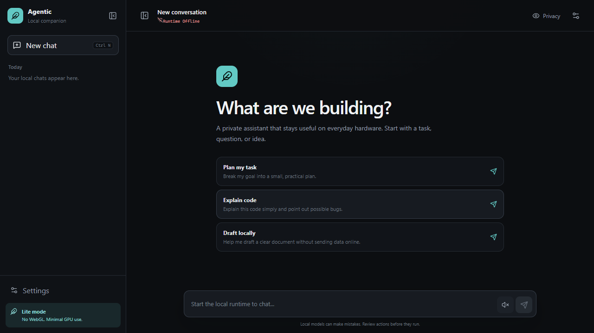

# Agentic

### A local-first AI companion for everyday computers

[](https://github.com/divyanshu-iitian/Agentic/actions/workflows/ci.yml)
[](LICENSE)
[](#why-agentic)
[](https://github.com/divyanshu-iitian/Agentic/releases)

Agentic combines a lightweight chat interface, local Ollama models, reusable
instruction skills, and opt-in desktop automation. It is designed around the
machines people already own, including CPU-only laptops with 8 GB of RAM.

> Agentic is pre-1.0 software. Use desktop automation on non-critical tasks and
> keep the emergency stop shortcut available.

## Why Agentic

- **Local by default:** Ollama is the default provider. Cloud inference is
  optional.
- **Modest hardware first:** no WebGL, particle canvas, remote font, or
  continuous GPU effect in the Lite interface.
- **Focused skills:** only task-relevant Markdown skills enter the prompt.
- **Bounded automation:** typed actions, strict arguments, allowlists, an action
  limit, and `Ctrl + Alt + Q` emergency stop.
- **Learns without training:** explicit user feedback persists locally, while
  temporary failure reflections help the current task recover.
- **Explicit privacy:** Privacy Mode masks the conversation before a screen
  share without attempting to bypass capture software.
- **Clean extension path:** skills are readable instructions rather than opaque
  executable plugins.

## Interface



The responsive chat surface includes offline feedback, voice controls, keyboard
navigation, reduced-motion support, runtime settings, and `Ctrl + Shift + P`
Privacy Mode.

## Hardware guide

| Machine | Suggested model | Good for |
| --- | --- | --- |
| 8 GB RAM, CPU only | `qwen2.5:3b` | Chat, planning, short coding tasks |
| 16 GB RAM | `qwen2.5-coder:7b` | Coding and multi-step reasoning |
| 24 GB+ or capable GPU | a quantized 14B model | Deeper reasoning |

Start with the 3B model. Increase model size only when latency and available
memory remain comfortable.

## Quick start

Requirements:

- Windows 10 or 11 for the current desktop automation surface
- Python 3.10+
- Node.js 20+
- [Ollama](https://ollama.com/)
- [Tesseract OCR](https://github.com/tesseract-ocr/tesseract), optional but
  recommended for screen understanding

```powershell
git clone https://github.com/divyanshu-iitian/Agentic.git
cd Agentic
.\setup.ps1
```

### Start lightweight chat

Terminal one:

```powershell
ollama serve
```

Terminal two:

```powershell
cd agentic-app\backend
..\..\.venv\Scripts\python.exe main.py
```

Terminal three:

```powershell
cd agentic-app\frontend
npm run dev
```

Open `http://127.0.0.1:5173`.

### Start desktop automation

```powershell
.\.venv\Scripts\python.exe main.py
```

Press `Ctrl + Space` to show the command surface. Press `Ctrl + Alt + Q` to
stop automation immediately.

## Runtime configuration

The default chat backend uses:

```env
CHAT_PROVIDER=ollama
OLLAMA_MODEL=qwen2.5:3b
OLLAMA_BASE_URL=http://127.0.0.1:11434
VOICE_ENABLED=false
```

Copy `agentic-app/backend/.env.example` to `.env` before changing these
values. Groq and Edge TTS are optional packages and are never required for the
local path.

## Skills

A skill lives at `skills/<name>/SKILL.md`:

```md
---
name: code-review
description: Review code with focused verification.
triggers:
  - review code
  - find bugs
---

1. Inspect callers before changing behavior.
2. Prioritize correctness over style.
3. Run the narrowest relevant test.
```

The registry selects at most two matching skills and caps their combined prompt
size. Skills cannot bypass action validation. See [the skills guide](skills/README.md).

## Research, applied

The runtime combines a compact ReAct-style loop, Reflexion-style failure
feedback, tiered memory inspired by MemGPT, Voyager-style reusable skills, and
OSWorld-style verification. The safety boundary also treats OCR, pages, and
tool output as untrusted data, following the risk demonstrated by AgentDojo.

See [research foundations](docs/research-foundations.md) for primary papers,
the exact implementation mapping, and limitations.

## Project map

```text
agentic-app/       React chat UI and FastAPI runtime
core/              Agent loop, state, memory, planning, skills
execution/         Desktop and browser action adapters
llm/               Ollama client, prompt, and response parser
perception/        Screen observation, OCR, UI state, change detection
planning/          Action validation
safety/            Kill switch and action limiting
skills/            Task-selected instruction skills
tests/             Fast deterministic tests
ui/                Classic desktop command surface
```

Read [the architecture guide](docs/architecture.md) for the complete flow.

## Development

```powershell
.\.venv\Scripts\python.exe -m pip install -r requirements-dev.txt
.\.venv\Scripts\python.exe -m pytest
.\.venv\Scripts\python.exe -m ruff check .

cd agentic-app\frontend
npm ci
npm run lint
npm run build
```

CI runs Python tests and the complete frontend build for every pull request.

## Safety and privacy

Desktop automation can click, type, and browse on your behalf. Review
`config.yaml`, use allowlists for sensitive environments, and never install
unreviewed skills.

Privacy Mode only masks this application's interface. It does not alter
third-party recording software or make automation invisible.

For vulnerability reporting, see [SECURITY.md](SECURITY.md).

## Status and roadmap

Working today:

- Ollama chat with optional Groq mode
- responsive low-GPU interface
- explicit Privacy Mode
- task-selected Markdown skills
- bounded feedback memory and task-local failure reflection
- strictly typed desktop and browser actions
- OCR-based screen observation
- clean Linux/Windows CI for Python and the web application

Next priorities are streaming, explicit permission prompts, runtime unification,
packaging, and repeatable low-end hardware benchmarks. See
[the roadmap](docs/roadmap.md).

## Contributing

Trying Agentic for the first time? [Share setup and hardware feedback](https://github.com/divyanshu-iitian/Agentic/issues/new?template=setup-feedback.yml), including where setup stopped or what worked on your machine. Please remove credentials, private conversations, and sensitive screen content from logs.

Focused improvements are welcome, especially lower memory use, safer
permissions, accessible UI, deterministic tests, and narrowly scoped skills.
Read [CONTRIBUTING.md](CONTRIBUTING.md) before opening a pull request.

Release history is in [CHANGELOG.md](CHANGELOG.md).

## License

MIT. See [LICENSE](LICENSE).
